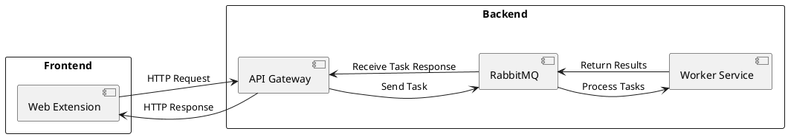

# О проекте

## Описание

Проект представляет систему рекомендаций тегов для создаваемых issue со стороны других команд в их проектах.

## Целевая аудитория

Целевой аудиторией проекта являются другие команды, которые разрабатывают open-source решения и использующие для управления задачами такие системы как GitLab, GitHub и пр. 

# Классификация задач

Для более удобного распределения задач между участниками проекта предлагается выделить основные области ответственности, которые охватывают все виды процессов разработки проекта. Каждая такая область будет фокусироваться на своей части разработки и поддержания проекта, что позволит, во-первых, разграничить зоны ответственности, и как следствие, понимать, кто из членов команды сможет выполнить эту задачу.

### ML

Участники команды, которые будут связаны с этой группой задач, будут в общем случае ответственны за знания, связанные с моделькой. Под это понятие, например, входит:
- Используемые методы обучения
- Используемая архитектура модели

В общем, все то, что связано с нейронкой и ее обучением. Стоит отметить, что члены команды, связанные с этой группой задачи, не ответственны, например, за получение процесс датасетов, они только выставляют требования к нему.

### Infra

Участники команды, которые будут связаны с этой группой задач, ответственны за развертывание и поддержание работы сервисов. Под это описание, например, входит:
- Написать docker и docker compose файлов для развертки проекта
- Сам процесс развертки проекта
- Развертывание вспомогательных сервисов, таких как RabbitMQ, например
- Автоматизация деплоя (CI / CD процессы)
- Обеспечение стабильной работы всех системных компонентов на проде (если он таковой будет в итоге)

### Development

Участники команды, которые будут связаны с этой группой задач, ответственны за разработку основного кода проекта. Такие задачки можно разделить на 2 подтипа:

- **Backend**
  Задачи такого подтипа имеют следующую зону ответственности:
	- Реализация бизнес-логики системы
	- Написание сервисов для обучения моделей
	- Создание API Gateway
- **Frontend**
  Задачи такого подтипа имеют следующую зону ответственности:
	- Разработка пользовательского интерфейса системы
	- Реализация веб-расширения
	- Интеграция с API Gateway

# MVP

На данном этапе нашей целью является реализация MVP (Минимально жизнеспособный продукт). В процессе разработки MVP мы стараемся избегать лишних деталей, поэтому на этой стадии проект будет иметь следующие ограничения:

1. Будет выбран 1 конкретный проект другой команды;
2. Будет 1 модель, обученная на issue целевого проекта.

## Архитектура

Упрощенно, архитектуру MVP можно представить следующим образом

- **Web Extension** - фронтенд часть проекта. Представляет из себя web расширение, задача которого состоит в графическом отображении результатов от API нашей системы. 

- **API Gateway** - сервис, находящийся на бэкенд-части системы. Представляет собой публичный API, с которым будем взаимодействовать Web Extension.

- **Rabbit MQ** - для общения сервисов бэкенд части вводится брокер сообщений, такой как Rabbit MQ. Через него одни сервисы отправляют запросы другим и получают от них ответы.

- **Worker Service** - основный сервис, представляющий 1 рабочую единицу. Принимает на вход запросы на рекомендацию тегов к текущему issue. Запросы принимает в виде сообщений от RabbitMQ, и по такому же протоколу возвращает результаты.
